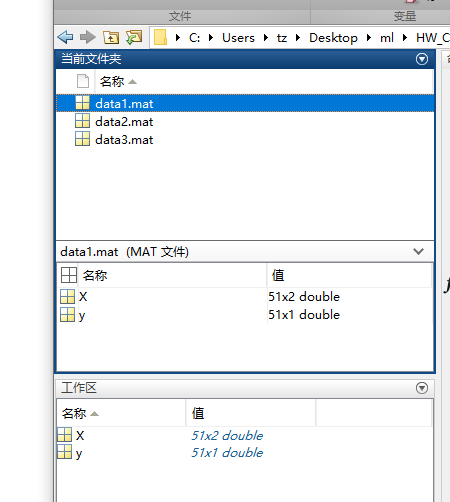
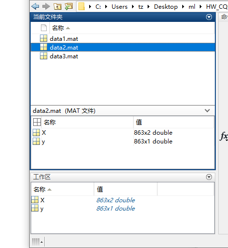
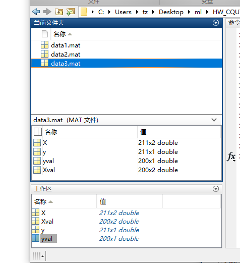

对于data1.mat和data2.mat和data3.mat三个文件，

其中data1.mat数据是：



data2：



data3：



对于python ，加载mat文件，如下：（参考:[Input and output (scipy.io) — SciPy v1.7.1 Manual](https://docs.scipy.org/doc/scipy/reference/io.html)）

在python中可以使用scipy.io中的函数loadmat()读取mat文件，函数savemat保存文件

```python
import scipy.io as scio

dataFile = './**/**/data.mat'	# 路径
data = scio.loadmat(dataFile)

# 注意，读取出来的data是字典格式，可以通过函数type(data)查看。
print type(data)	# <type 'dict'>

# 
print data['X']	# 这个是表示找出名字为X的数据，然后给出。格式为<type 'numpy.ndarray'>，即为numpy中的矩阵格式。 
```

对于，如果要保存mat文件，也可以使用python

```python
dataNew = './dataNew.mat'	# 路径
scio.savemat(dataNew, {'A':data['A']})	# 注意：是以字典的形式保存。 
```


对于SVM的学习可以看：

[SVM算法 - 知乎 (zhihu.com)](https://zhuanlan.zhihu.com/p/29862011)，感觉很详细，可以参考参考。

[【机器学习】支持向量机 SVM（非常详细） - 知乎 (zhihu.com)](https://zhuanlan.zhihu.com/p/77750026)这个也不错


函数说明：

* [sklearn.svm.LinearSVC-scikit-learn中文社区](https://scikit-learn.org.cn/view/776.html)

- [sklearn.svm.SVC — scikit-learn 1.0.1 documentation](https://scikit-learn.org/stable/modules/generated/sklearn.svm.SVC.html)
- 中文社区：[sklearn.svm.SVC-scikit-learn中文社区](https://scikit-learn.org.cn/view/781.html)

